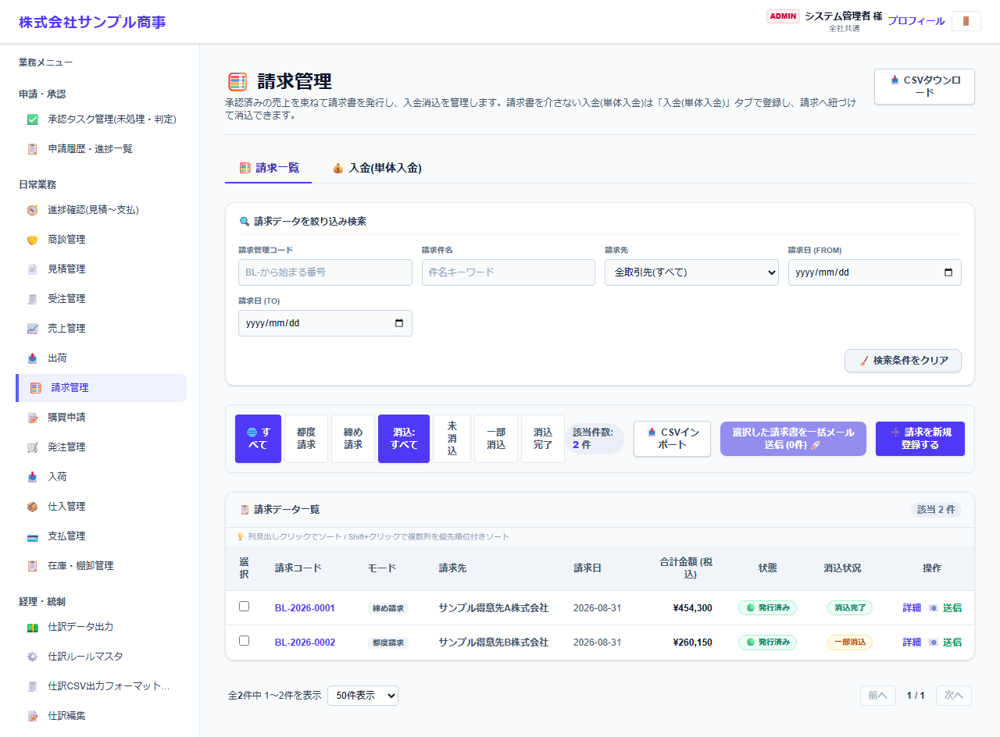
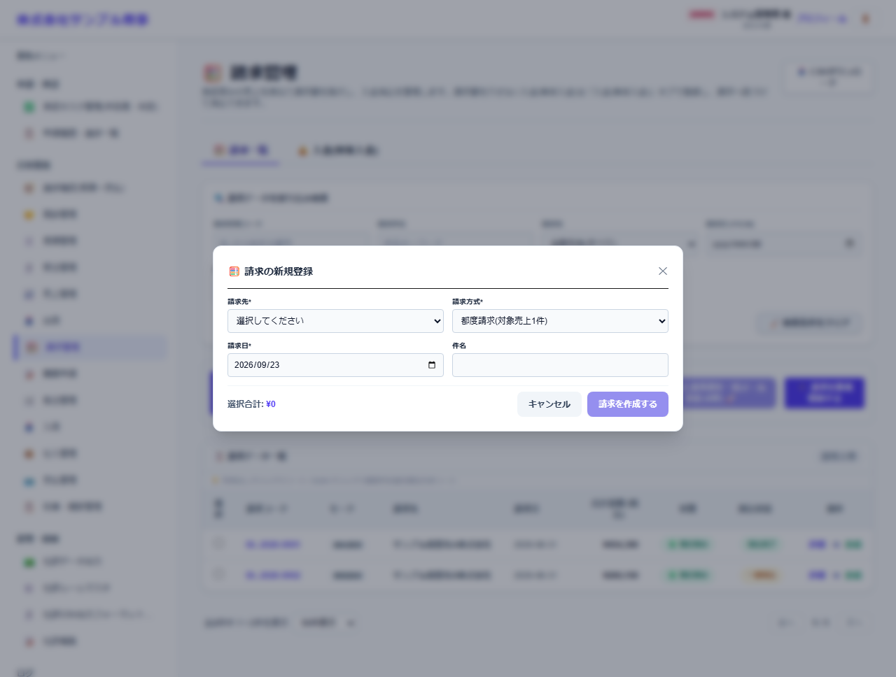
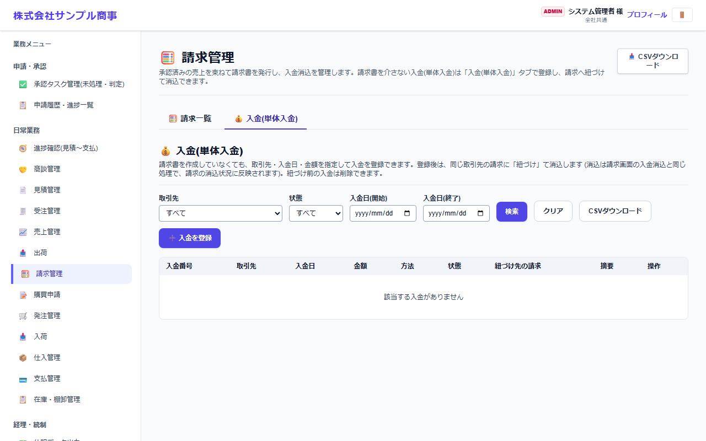

# 請求管理

[マニュアルの一覧](../README.md) > 日常業務 > 請求管理

承認済みの売上をまとめて請求書を作り、入金を記録して消し込みます。請求書を使わない入金(前受金など)は **入金(単体入金)** タブで登録します。

- **開き方**: メニューの **日常業務** > **請求管理**
- **対象**: 全員
- 一覧・検索・並び替え・CSV・承認の共通の操作は、[共通の操作](../basics/common-operations.md) を参照してください。

## 請求一覧

- 状態のタブで、請求の方式(都度請求・締め請求)や、消込の状況(未消込・一部消込・消込完了)で絞り込みます。
- 一覧の **詳細** で請求の内容と入金の記録、**送信** で請求書のメール送信ができます。

## 請求を作る

**請求を新規登録する** を押すと、請求の作成の画面が開きます。

| 項目 | 説明 |
|---|---|
| 請求先 * | |
| 請求方式 * | **都度請求**(売上1件ごと)か、**締め請求**(締め日までの売上をまとめる) |
| 請求日 *・件名 | |

請求先・方式を選ぶと、対象の売上が表示されます。選んで **請求を作成する** を押します。作成した請求は、請求書の PDF として出力・メール送信できます。

## 入金を消し込む

請求の **詳細** から入金(入金日・金額・方法)を記録します。入金の合計が請求額に達すると **消込完了** になります。

## 入金(単体入金)

請求書を作らない入金(前受金など)を登録します。**入金を登録** から取引先・入金日・金額・方法を入力します。
登録した後、同じ取引先の請求に **紐づけ** ると、その請求の消込になります。紐づけ前の入金は削除できます。
