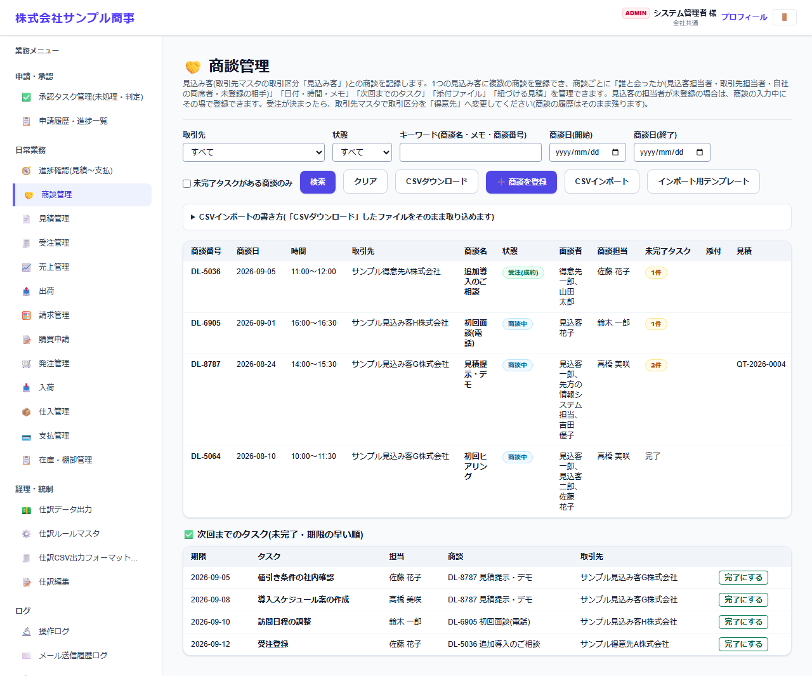
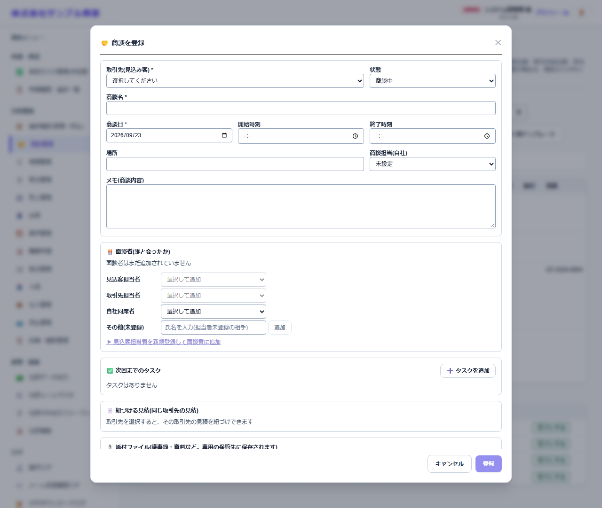

# 商談管理

[マニュアルの一覧](../README.md) > 日常業務 > 商談管理

見込み客・得意先との商談(打ち合わせ・訪問など)を記録します。誰と会ったか、次回までのタスク、関連する見積も記録できます。

- **開き方**: メニューの **日常業務** > **商談管理**
- **対象**: 全員
- 一覧・検索・並び替え・CSV・承認の共通の操作は、[共通の操作](../basics/common-operations.md) を参照してください。

## 一覧

- 取引先・状態・キーワード(商談名・メモ・面談者名)・商談日で絞り込み、**検索** を押します。**未完了タスクがある商談のみ** で、やり残しのある商談だけを表示します。
- 一覧には、商談番号・商談日・時間・取引先・商談名・状態・面談者・自社担当・未完了タスク・添付・見積が表示されます。
- 画面の下の **次回までのタスク(未完了・期限の早い順)** で、タスクの期限・担当を確認し、終わったら **完了にする** を押します。

## 商談を登録する

**商談を登録** を押すと、登録の画面が開きます。

| 項目 | 説明 |
|---|---|
| 取引先(見込み客) * | 商談の相手。見込み客も選べます |
| 状態 | 提案中・成約・失注など |
| 商談名 * | |
| 商談日 *・開始時刻・終了時刻・場所 | |
| 商談担当(自社) | |
| 内容 | 話した内容など |
| 面談者(誰と会ったか) | 取引先担当者・社員から選ぶか、氏名を自由に入力します。担当者マスタに無い見込み客の担当者は、その場で新しく登録できます |
| 次回までのタスク | **+ タスクを追加** で、内容・担当・期限を登録します |
| 紐づける見積 | 同じ取引先の見積を選ぶと、商談と見積を関連付けられます |
| 添付ファイル | 議事録・資料など |

## CSV で取り込む・出力する

**CSVインポート** で一括登録できます。1つの商談を複数の行で表します(面談者・タスクごとに1行)。書き方は **CSVインポートの書き方** を開くと表示されます。**インポート用テンプレート** で見本の CSV を保存できます。
