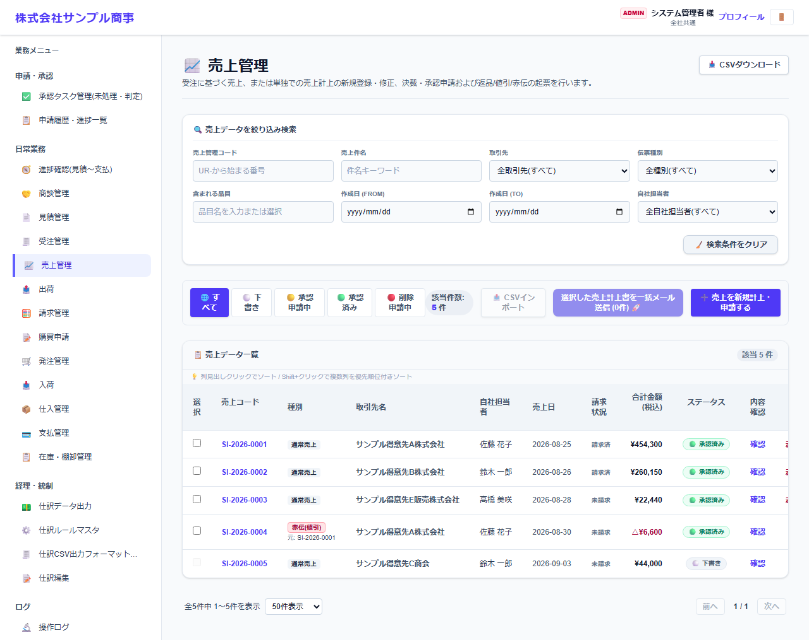
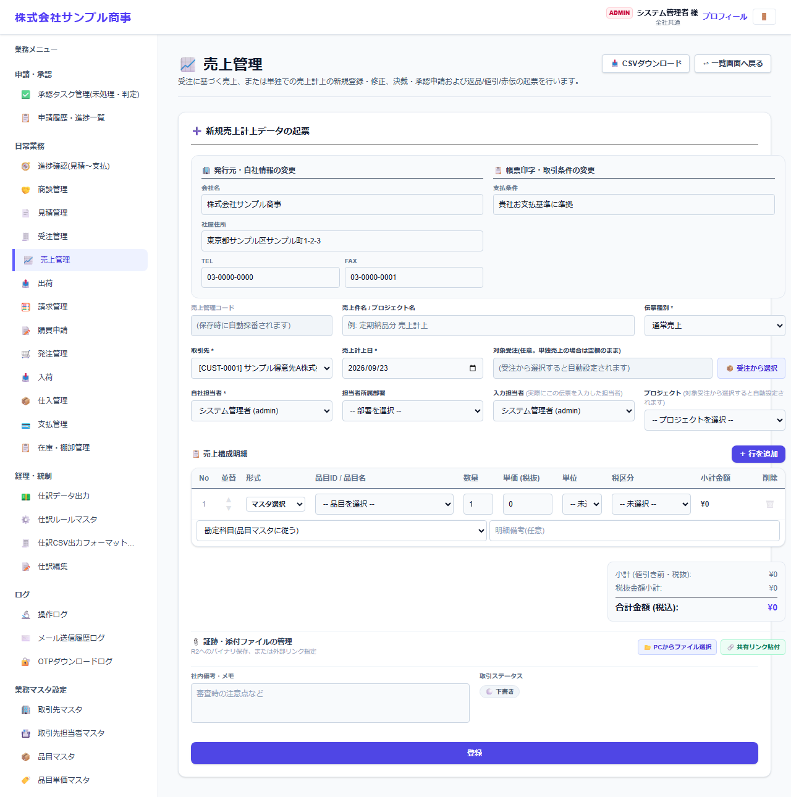

# 売上管理

[マニュアルの一覧](../README.md) > 日常業務 > 売上管理

売上を計上します。受注から作る方法と、受注なしで直接作る方法があります。返品・値引は、元の売上を打ち消す赤伝(マイナスの伝票)で登録します。

- **開き方**: メニューの **日常業務** > **売上管理**
- **対象**: 全員
- 一覧・検索・並び替え・CSV・承認の共通の操作は、[共通の操作](../basics/common-operations.md) を参照してください。

## 一覧

### 一覧の操作

| 操作 | 内容 |
|---|---|
| 状態のタブ | すべて・下書き・承認申請中・承認済み・削除申請中で絞り込みます |
| 絞り込み検索 | 番号・件名・取引先・品目・作成日・自社担当者などで探します |
| 番号を押す | 伝票を開いて、内容の確認・変更・PDF の出力などを行います |
| 左端のチェックボックス + 一括メール送信 | 選んだ伝票の帳票を、取引先の担当者にまとめてメールで送ります(送り先は取引先担当者マスタの「メールで送る帳票」で決まります) |
| CSVインポート / CSVダウンロード | 伝票を一括で取り込む・保存する |

- 一覧の **種類** に、通常売上・赤伝(返品・値引)が表示されます。赤伝には、元の売上の番号が表示されます。
- **請求状況** で、請求書に含めたかどうかが分かります。

## 売上を計上する

**売上を新規計上・申請する** を押すと、計上の画面になります。

| 項目 | 説明 |
|---|---|
| 伝票種類 * | 通常売上・返品・値引(赤伝)など |
| 取引先 *・売上計上日 * | |
| 対象受注 | **受注から選択** を押すと、受注の残りの数量から明細を作ります。受注を選ばない場合は、直接売上になります |
| 明細 | 品目・数量・単価・税区分。明細ごとに勘定科目を指定できます(既定は品目マスタの科目) |

- 会社・システム設定で「出荷済みの数量までしか売上にできない」ようにしている場合は、出荷した数量が上限になります。

## 売上関連書類を送る

登録した売上を開くと、売上関連書類(売上計上書)の PDF を出力し、メールで送れます。
