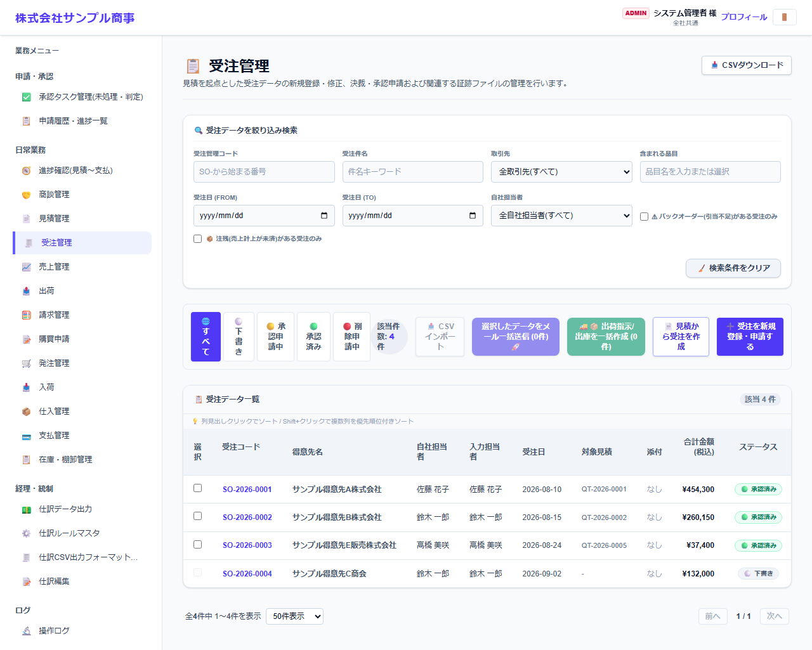
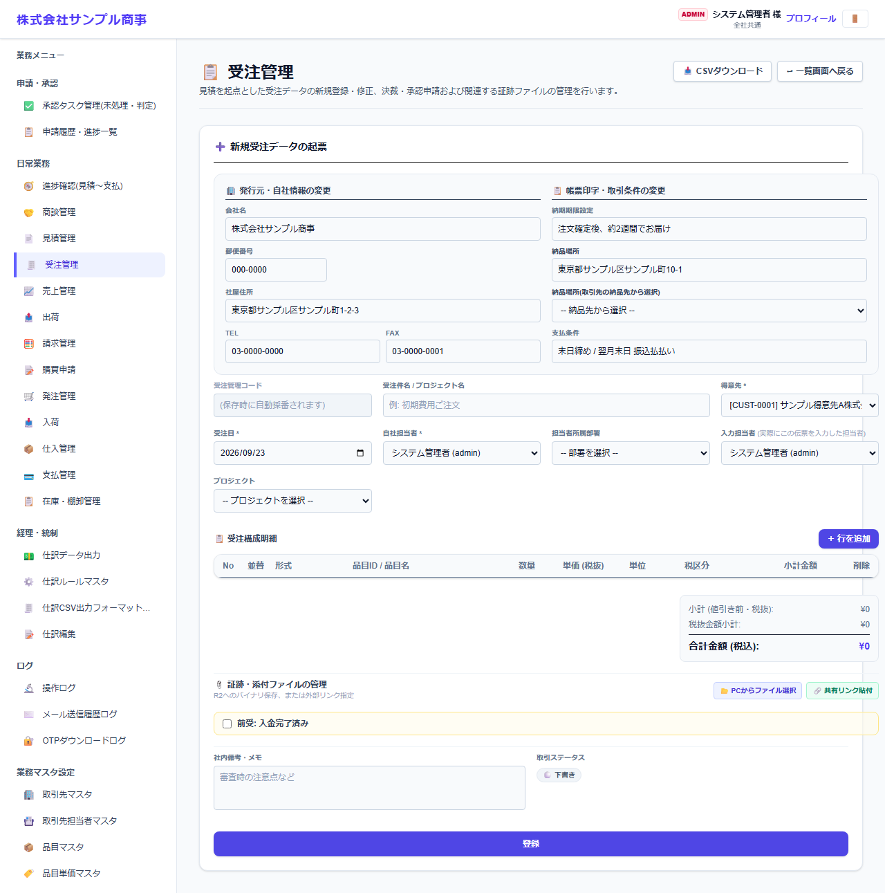

# 受注管理

[マニュアルの一覧](../README.md) > 日常業務 > 受注管理

得意先からの注文(受注)を登録します。承認されると、在庫を引き当てます。注文請書の PDF 出力・メール送信もここで行います。

- **開き方**: メニューの **日常業務** > **受注管理**
- **対象**: 全員
- 一覧・検索・並び替え・CSV・承認の共通の操作は、[共通の操作](../basics/common-operations.md) を参照してください。

## 一覧

### 一覧の操作

| 操作 | 内容 |
|---|---|
| 状態のタブ | すべて・下書き・承認申請中・承認済み・削除申請中で絞り込みます |
| 絞り込み検索 | 番号・件名・取引先・品目・作成日・自社担当者などで探します |
| 番号を押す | 伝票を開いて、内容の確認・変更・PDF の出力などを行います |
| 左端のチェックボックス + 一括メール送信 | 選んだ伝票の帳票を、取引先の担当者にまとめてメールで送ります(送り先は取引先担当者マスタの「メールで送る帳票」で決まります) |
| CSVインポート / CSVダウンロード | 伝票を一括で取り込む・保存する |

- **バックオーダー(引当不足)がある受注のみ**: 在庫が足りずに引き当てられなかった受注だけを表示します。
- **出荷(売上計上)が未完了の受注のみ**: まだ全部を売上にしていない受注だけを表示します。
- **見積から受注を作成**: 承認済みの見積を選んで、内容を受注に引き継ぎます。

## 受注を登録する

**受注を新規登録・申請する** を押すと、登録の画面になります。

見積とほぼ同じ項目です。受注ならではの項目は次のとおりです。

| 項目 | 説明 |
|---|---|
| 受注日 * | |
| 納品場所(取引先の納品先から選択) | 取引先マスタで登録した納品先から選べます(住所が注文請書・納品書に印字されます)。自由に入力もできます |
| 前受: 入金完了済み | 先に入金を受ける(前受)取引で、入金が済んだら付けます |
| 明細の倉庫の指定 | 明細ごとに、どの倉庫から出すか(倉庫 × 数量)を指定できます。指定しない場合は自動で割り当てます |

## 在庫の引当と出荷

- 受注が承認されると、在庫を引き当てます。足りない分はバックオーダーになります(承認は止めません)。
- 出荷は **出荷** の画面で、受注から出荷指示・出庫を作ります。出荷が済んだら、**売上管理** で売上にします。
- 在庫が足りない品目は、**購買申請** の **受注の欠品から購買申請を作成** で仕入の手配ができます。
