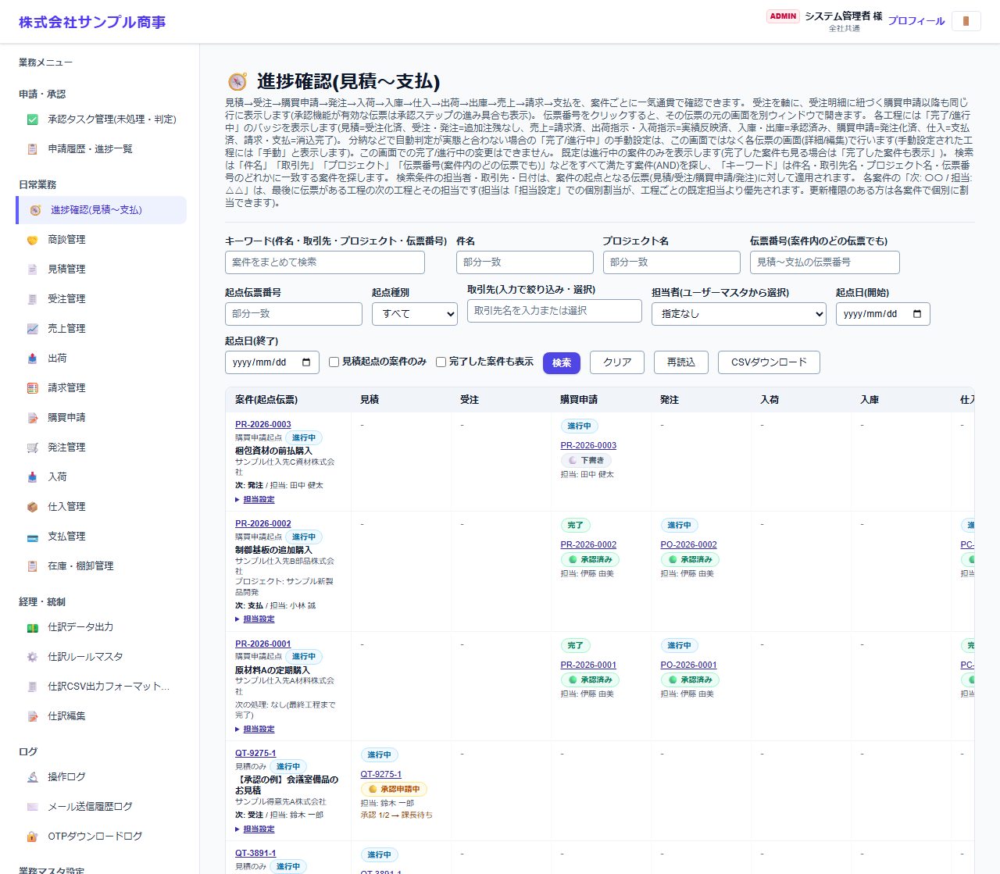

# 進捗確認(見積〜支払)

[マニュアルの一覧](../README.md) > 日常業務 > 進捗確認(見積〜支払)

案件ごとに、見積 → 受注 → 購買申請 → 発注 → 入荷 → 入庫 → 仕入 → 出荷 → 出庫 → 売上 → 請求 → 支払 の各工程が、どこまで進んでいるかを一覧で確認します。**確認専用の画面**で、ここからデータは変更できません。

- **開き方**: メニューの **日常業務** > **進捗確認(見積〜支払)**
- **対象**: 全員
- 一覧・検索・並び替え・CSV・承認の共通の操作は、[共通の操作](../basics/common-operations.md) を参照してください。

## 画面

- 1行が1つの案件です。案件の起点(最初の伝票。見積・受注・購買申請など)と、工程ごとの伝票が並びます。
- 各工程には、伝票番号と状態(**進行中**・**完了**・承認済みなど)、担当者が表示されます。**伝票番号を押すと、その伝票の画面が開きます**。
- 完了/進行中は、伝票の状態から自動で判定します(例: 受注は、全明細が売上になったら完了)。分納などで判定と実態が合わない場合は、**各伝票の画面**で完了/進行中を手動で設定します。

## 絞り込む

| 条件 | 内容 |
|---|---|
| キーワード | 件名・取引先・プロジェクト・伝票番号などで探します |
| 件名・プロジェクト名・伝票番号 | 案件に含まれる伝票の条件 |
| 起点伝票番号・起点種類・起点日 | 案件の最初の伝票の条件 |
| 取引先・担当者 | 担当者はユーザーマスタから選びます |
| 見積起点の案件のみ | 見積から始まった案件だけを表示します |
| 完了した案件も表示 | 既定では、完了した案件は表示しません |

## 補足

- 工程ごとの既定の担当者は、システム管理者が **進捗確認: 工程ごとの担当設定** で設定します。
- **CSVダウンロード** で、表示中の一覧を保存できます。
