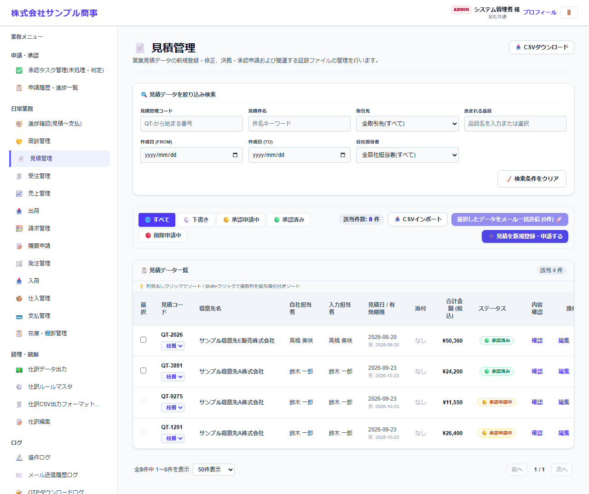
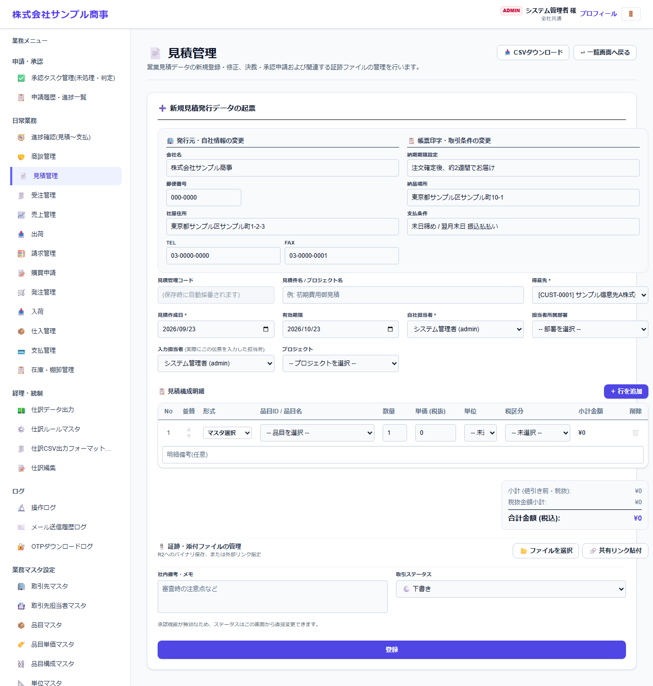

# 見積管理

[マニュアルの一覧](../README.md) > 日常業務 > 見積管理

見積を作成し、見積書を PDF で出力したり、メールで送ったりします。承認機能を使う場合は、承認されてから見積書を送ります。

- **開き方**: メニューの **日常業務** > **見積管理**
- **対象**: 全員
- 一覧・検索・並び替え・CSV・承認の共通の操作は、[共通の操作](../basics/common-operations.md) を参照してください。

## 一覧

### 一覧の操作

| 操作 | 内容 |
|---|---|
| 状態のタブ | すべて・下書き・承認申請中・承認済み・削除申請中で絞り込みます |
| 絞り込み検索 | 番号・件名・取引先・品目・作成日・自社担当者などで探します |
| 番号を押す | 伝票を開いて、内容の確認・変更・PDF の出力などを行います |
| 左端のチェックボックス + 一括メール送信 | 選んだ伝票の帳票を、取引先の担当者にまとめてメールで送ります(送り先は取引先担当者マスタの「メールで送る帳票」で決まります) |
| CSVインポート / CSVダウンロード | 伝票を一括で取り込む・保存する |

## 見積を作成する

**見積を新規登録・申請する** を押すと、作成の画面になります(**一覧画面へ戻る** で一覧に戻ります)。

| 欄 | 内容 |
|---|---|
| 発行元・自社情報の変更 | 見積書に印字する自社の会社名・住所・電話など。会社・システム設定の値が入っています。この見積だけ変えたい時に書き換えます |
| 帳票印字・取引条件の変更 | 納期・納品場所・支払条件など、見積書に印字する条件 |
| 見積管理コード・見積件名 | コードは保存時に自動で付きます |
| 得意先 *・見積作成日 *・有効期限 | |
| 自社担当者 *・担当者所属部署・入力担当者・プロジェクト | 入力担当者は、実際に入力した人(営業担当とは別に記録します) |
| 見積構成明細 | **+ 行を追加** で行を増やします。形式(マスタ選択・手入力)、品目、数量、単価、単位、税区分を入力すると、小計・消費税・合計が自動で計算されます |
| 証跡・添付ファイルの管理 | ファイル・共有リンクを添付します |
| 社内備考・メモ・取引ステータス | 取引ステータスは、承認機能を使わない場合に画面から変更できます |

入力したら **登録** を押します。承認機能を使っている場合は、登録すると承認の申請になります。

## 見積書を送る・受注にする

- 登録した見積を開くと、**見積書の PDF** の出力と、取引先へのメール送信ができます。メールには、取引先が確認コード(OTP)を入れてダウンロードするリンクを付けられます([取引先向けのダウンロード](../external/document-download.md))。
- 内容を変える場合は、版(バージョン)を上げて修正できます。
- 受注になった見積は、**受注管理** の **見積から受注を作成** で受注に引き継げます。
