# 申請から承認までの流れ

[マニュアルの一覧](../README.md) > 申請・承認 > 申請から承認までの流れ

承認機能を使っている場合の、申請 → 承認・差戻し → 再申請 の流れを、見積を例に説明します。
受注・発注・売上・仕入・在庫の操作・マスタの登録なども、同じ流れです。

- **例の登場人物**: 申請する人 = 営業第一課の **鈴木 一郎**(一般社員)、承認する人 = 営業第一課の **佐藤 花子**(課長)
- **承認の経路**: 見積(100万円未満)は「作成・申請(一般社員) → 課長承認」の2段です。経路はシステム管理者が [承認フロー定義](../admin/approval-flows.md) で設定します。
- 承認機能を使うかどうかは、システム管理者が [会社・システム設定](../admin/company-settings.md) で、伝票・マスタの種類ごとに切り替えます。

## 1. 申請する(申請する人)

見積を作って保存すると、**下書き** になります。

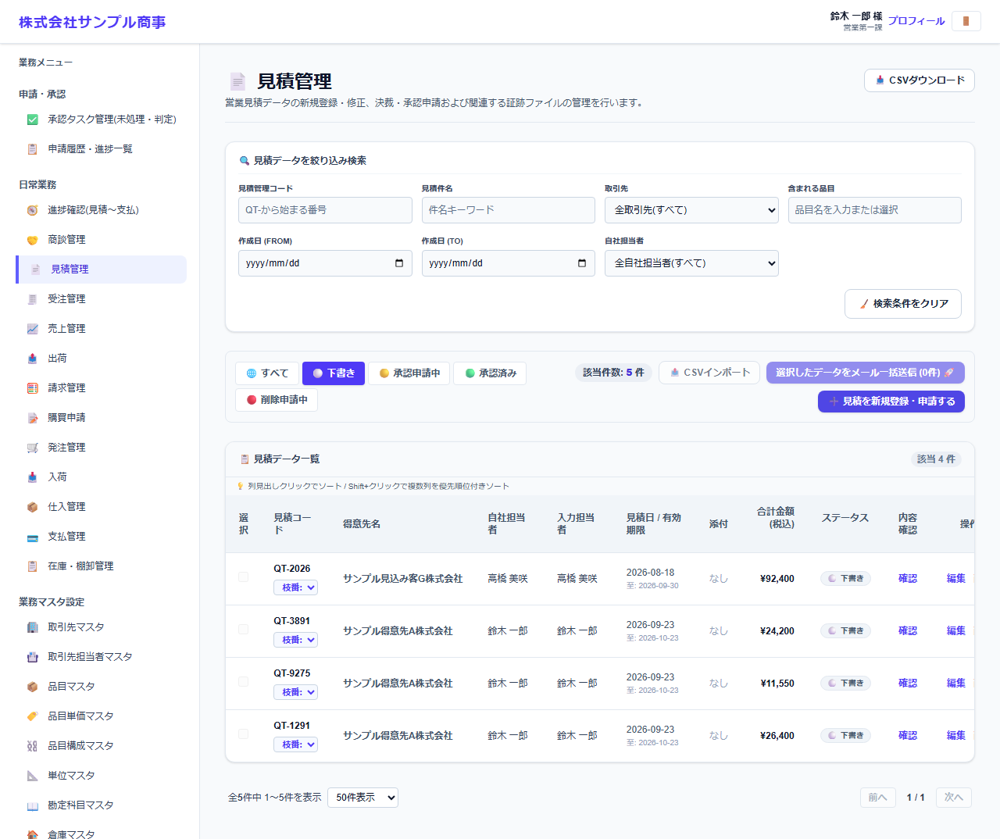

1. 見積管理の一覧で **下書き** のタブを選び、申請する見積を押して開きます。
2. 内容を確認して、画面の下の **🚀 承認を申請する** を押します。
   - 複数の部署に所属している場合は、どの部署として申請するか(**申請部署**)を選びます。承認者は、この部署から決まります。
   - 登録の直後に表示される確認の画面で **🚀 このまま承認を申請する** を押しても申請できます。

申請すると、見積は **承認申請中** になり、内容を変更できなくなります。承認者に、承認依頼のメール(または Slack)が届きます。

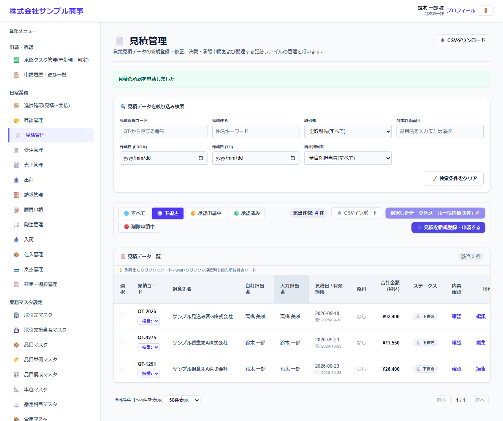

申請した後の状況は、[申請履歴・進捗一覧](histories.md) で確認できます。承認待ちの申請は、**取下げ** で取り下げられます(取り下げると下書きに戻ります)。

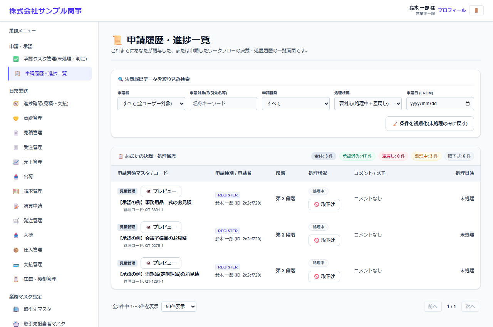

## 2. 承認する・差し戻す(承認する人)

承認依頼が届くと、ダッシュボードの **あなたの承認待ち案件** に表示されます。

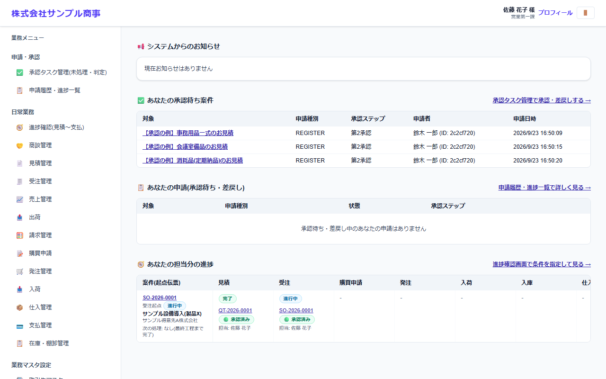

[承認タスク管理(未処理・判定)](tasks.md) を開くと、あなたが承認する申請が並びます。

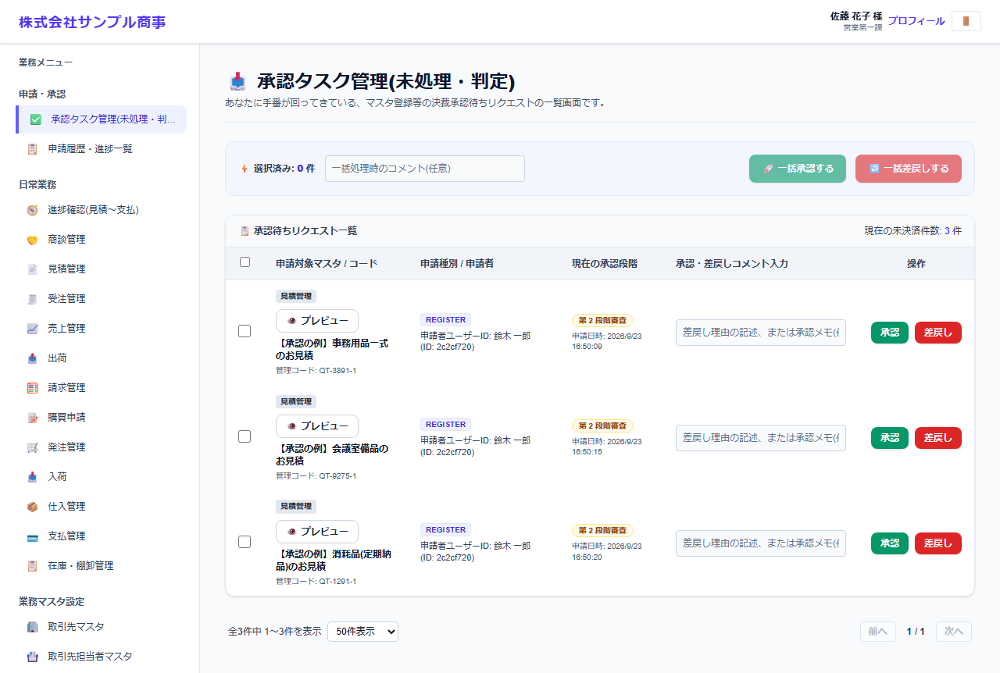

1. **👁️ プレビュー** を押すと、承認の経路(今どの段か)と、申請の内容が表示されます。

   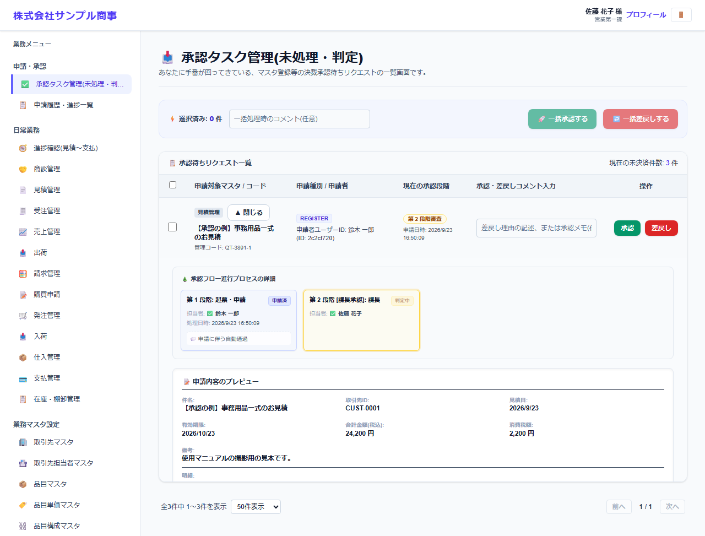

2. 必要なら、**承認・差戻しコメント** を入力します(差し戻す時は、直してほしい点を書いてください)。
3. **承認** または **差戻し** を押します。
   - **承認**: 次の段の承認者に回ります。最後の段で承認されると確定し、見積は **承認済み** になります。
   - **差戻し**: 見積は **下書き** に戻り、申請者が直して再申請できます。

処理した申請は一覧から消えます。

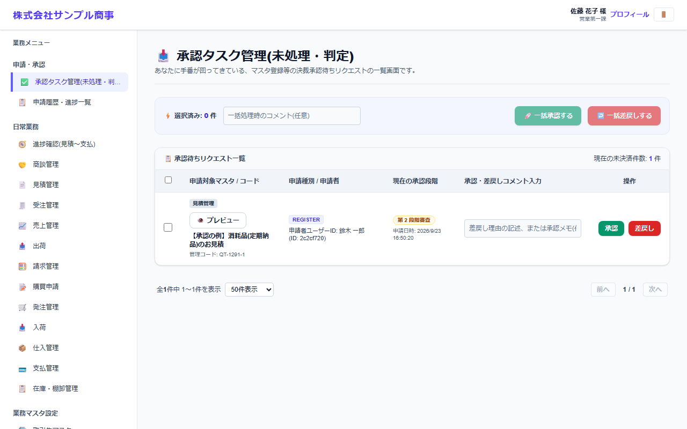

## 3. 結果を確認し、差し戻されたら直して再申請する(申請する人)

承認・差戻しの結果は、メール(または Slack)で届きます。ダッシュボードの **あなたの申請(承認待ち・差戻し)** にも表示されます。

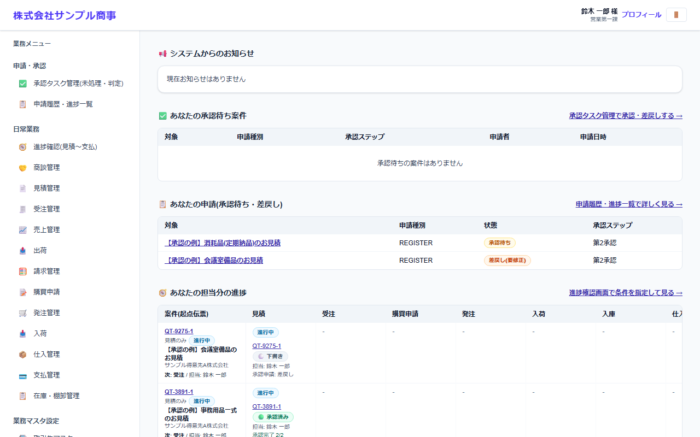

申請履歴では、差戻しのコメントを確認できます。

差し戻された見積は下書きに戻っています。開いて内容を直し、**保存** してから、もう一度 **🚀 承認を申請する** を押します。

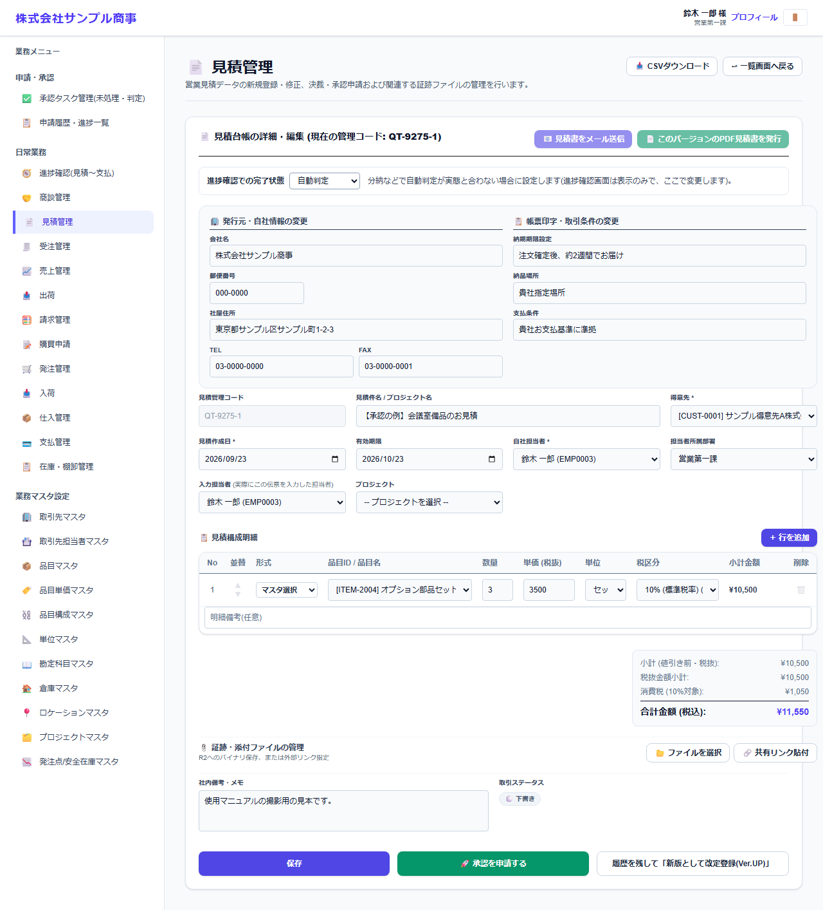

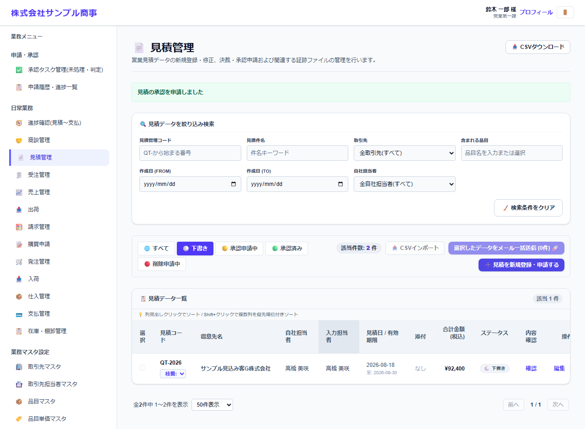

## 通知メールの記録

承認依頼・承認完了・差戻しの通知メールは、システム管理者が [メール送信履歴ログ](../logs/mail-logs.md) で確認できます(**ログを検索** を押すと表示されます)。

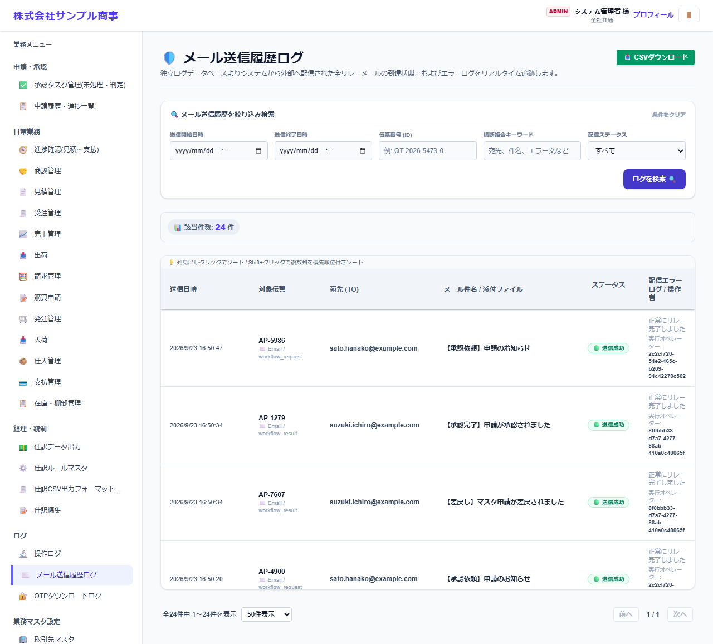

## 承認済みの内容を変える・削除する

- 承認済みの見積の内容を変える場合は、見積を開いて **🔒 変更を申請する**、または版を上げて改定します。変更の申請も、同じ流れで承認されます。
- 承認済みの見積を一覧の **削除** で削除しようとすると、削除の申請になります(**削除申請中** になり、承認されると削除されます)。下書きの見積は、申請なしでそのまま削除されます。
