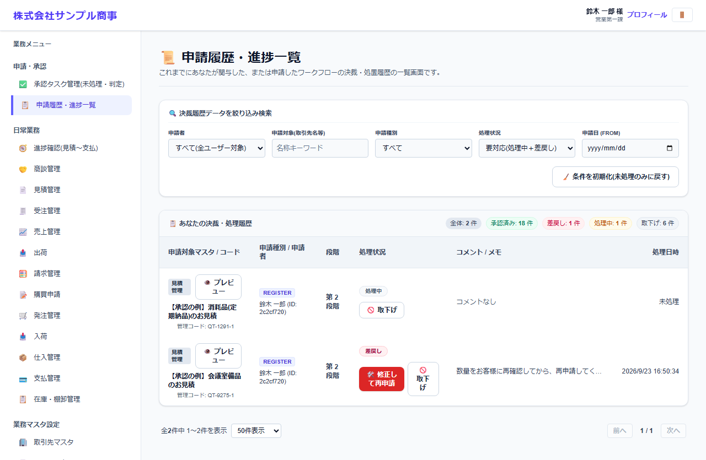
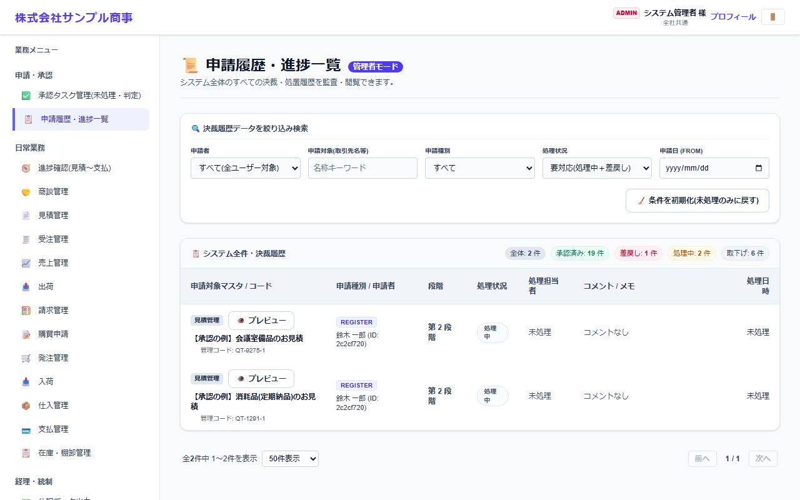

# 申請履歴・進捗一覧

[マニュアルの一覧](../README.md) > 申請・承認 > 申請履歴・進捗一覧

申請の状況(承認待ち・承認済み・差戻し・取下げ)と、承認の履歴を確認します。一般のユーザーは自分の申請、管理者はすべての申請を確認できます(管理者の場合は **管理者モード** と表示されます)。

- **開き方**: メニューの **申請・承認** > **申請履歴・進捗一覧**
- **対象**: 全員
- 一覧・検索・並び替え・CSV・承認の共通の操作は、[共通の操作](../basics/common-operations.md) を参照してください。

## 画面

一般のユーザーの画面(自分の申請)です。

**決裁履歴データを絞り込み検索**で、申請者・申請対象(取引先名など)・申請種別・処理状況・申請日で絞り込めます。
**条件を初期化(未処理のみに戻す)** で、処理中・差戻しの申請だけの表示に戻ります。

一覧の右上に、全体・承認済み・差戻し・処理中・取下げの件数が表示されます。各行には、処理状況・承認者のコメント・処理日時が表示され、**👁️ プレビュー** で申請の内容を確認できます。

| 処理状況 | できること |
|---|---|
| 処理中(承認待ち) | **取下げ**: 申請を取り下げます(伝票は下書きに戻ります) |
| 差戻し | **修正して再申請**: 伝票・マスタの画面を開きます。直して再申請します |

管理者の画面(**管理者モード**)では、全員の申請が表示されます。

## 差し戻された申請を直す

差し戻された申請は、**修正して再申請** で伝票・マスタの画面を開き、内容を直して再申請します。
ダッシュボードの **あなたの申請(承認待ち・差戻し)** からも開けます。流れの全体は、[申請から承認までの流れ](approval-flow.md) を参照してください。
